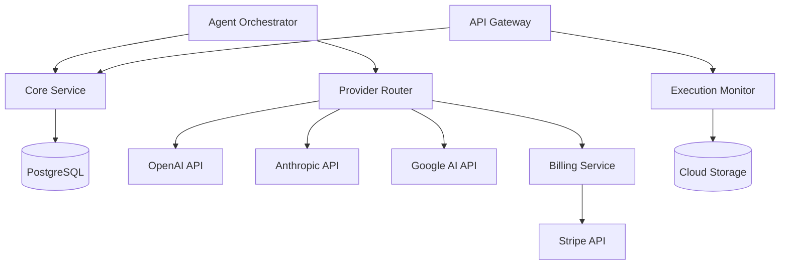

# AgentWorks - Microservices Architecture

**Version:** 1.0  
**Date:** 2025-12-02  
**Owner:** Architect Agent  
**Status:** Implementation Ready  

---

## 1. Service Decomposition Strategy

AgentWorks follows a domain-driven microservices architecture with clear service boundaries based on business capabilities and data ownership.

### 1.1 Service Boundaries

```
Core Domain Services:
┌─────────────────┐  ┌─────────────────┐  ┌─────────────────┐
│   Workspace     │  │    Project      │  │     Board       │
│   Management    │  │   Management    │  │   Management    │
│                 │  │                 │  │                 │
│ • Users         │  │ • Projects      │  │ • Boards        │
│ • Workspaces    │  │ • Docs          │  │ • Lanes         │
│ • Memberships   │  │ • Configs       │  │ • Cards         │
└─────────────────┘  └─────────────────┘  └─────────────────┘

Agent Domain Services:
┌─────────────────┐  ┌─────────────────┐  ┌─────────────────┐
│     Agent       │  │    Provider     │  │   Execution     │
│  Orchestration  │  │     Router      │  │    Monitor      │
│                 │  │                 │  │                 │
│ • Agent Runs    │  │ • LLM Routing   │  │ • Log Stream    │
│ • Coordination  │  │ • Cost Calc     │  │ • Real-time     │
│ • Workflows     │  │ • Usage Track   │  │ • Analytics     │
└─────────────────┘  └─────────────────┘  └─────────────────┘

Platform Services:
┌─────────────────┐  ┌─────────────────┐  ┌─────────────────┐
│   API Gateway   │  │     Billing     │  │   Notification  │
│                 │  │    Service      │  │    Service      │
│ • Auth          │  │                 │  │                 │
│ • Rate Limiting │  │ • Usage Agg     │  │ • WebSocket     │
│ • Routing       │  │ • Invoicing     │  │ • Events        │
└─────────────────┘  └─────────────────┘  └─────────────────┘
```

---

## 2. Service Specifications

### 2.1 API Gateway Service

**Service Name**: `agentworks-gateway`  
**Technology**: Fastify + TypeScript  
**Deployment**: Cloud Run (always 1+ instances)  
**Database**: None (stateless)  

**Responsibilities**:
- Request routing to downstream services
- Authentication and session management
- Rate limiting and DDoS protection
- Request/response transformation
- CORS handling
- WebSocket connection management

**Configuration**:
```yaml
apiVersion: serving.knative.dev/v1
kind: Service
metadata:
  name: agentworks-gateway
  annotations:
    run.googleapis.com/execution-environment: gen2
spec:
  template:
    metadata:
      annotations:
        autoscaling.knative.dev/minScale: "1"
        autoscaling.knative.dev/maxScale: "100"
        run.googleapis.com/cpu-throttling: "false"
    spec:
      containerConcurrency: 100
      containers:
      - image: gcr.io/PROJECT/agentworks-gateway:latest
        resources:
          limits:
            cpu: 1000m
            memory: 512Mi
        env:
        - name: NODE_ENV
          value: production
        - name: JWT_SECRET
          valueFrom:
            secretKeyRef:
              name: app-secrets
              key: jwt-secret
```

**API Routes**:
```typescript
// Authentication
POST   /auth/login
POST   /auth/logout
POST   /auth/register
GET    /auth/me

// Workspace Management
GET    /api/workspaces
POST   /api/workspaces
GET    /api/workspaces/:id
PUT    /api/workspaces/:id
DELETE /api/workspaces/:id

// Project Operations  
GET    /api/workspaces/:wsId/projects
POST   /api/workspaces/:wsId/projects
GET    /api/projects/:id
PUT    /api/projects/:id

// Board & Card Operations
GET    /api/projects/:id/boards
POST   /api/projects/:id/cards
PUT    /api/cards/:id/move
GET    /api/cards/:id/runs

// Agent Operations
POST   /api/cards/:id/agents/:agent/run
GET    /api/agents
PUT    /api/projects/:id/agent-config

// Real-time Endpoints
WS     /api/cards/:id/terminal
WS     /api/workspaces/:id/events

// Usage & Billing
GET    /api/workspaces/:id/usage
GET    /api/workspaces/:id/billing
```

### 2.2 Core Service

**Service Name**: `agentworks-core`  
**Technology**: Fastify + Prisma + TypeScript  
**Deployment**: Cloud Run (auto-scaling)  
**Database**: PostgreSQL (AlloyDB)  

**Responsibilities**:
- Core business logic for workspaces, projects, boards, cards
- Data persistence and validation
- Multi-tenant data isolation
- CRUD operations with business rules

**Database Schema Highlights**:
```sql
-- Multi-tenant workspace isolation
CREATE POLICY workspace_isolation ON cards
FOR ALL TO authenticated_users
USING (workspace_id IN (
  SELECT workspace_id FROM workspace_members 
  WHERE user_id = current_user_id()
));

-- Optimized indexes for common queries
CREATE INDEX CONCURRENTLY idx_cards_board_lane 
ON cards(board_id, lane_id, position);

CREATE INDEX CONCURRENTLY idx_agent_runs_card_status 
ON agent_runs(card_id, status, created_at);
```

**Service Interface**:
```typescript
interface CoreService {
  // Workspace Management
  createWorkspace(data: CreateWorkspaceRequest): Promise<Workspace>;
  getWorkspace(id: string, userId: string): Promise<Workspace>;
  updateWorkspace(id: string, data: UpdateWorkspaceRequest): Promise<Workspace>;
  
  // Project Management
  createProject(workspaceId: string, data: CreateProjectRequest): Promise<Project>;
  getProject(id: string): Promise<Project>;
  updateProject(id: string, data: UpdateProjectRequest): Promise<Project>;
  
  // Board Operations
  createBoard(projectId: string): Promise<Board>;
  getBoard(id: string): Promise<BoardWithLanesAndCards>;
  moveCard(cardId: string, toLane: number, position: number): Promise<Card>;
  
  // Card Management
  createCard(boardId: string, data: CreateCardRequest): Promise<Card>;
  updateCard(id: string, data: UpdateCardRequest): Promise<Card>;
  getCard(id: string): Promise<CardWithRuns>;
}
```

### 2.3 Agent Orchestrator Service

**Service Name**: `agentworks-orchestrator`  
**Technology**: Node.js + TypeScript  
**Deployment**: Cloud Run (event-driven scaling)  
**Event Sources**: Pub/Sub subscriptions  

**Responsibilities**:
- Listen to card events and determine agent actions
- Orchestrate agent workflows based on lane rules
- Coordinate multiple agents for complex tasks
- Maintain agent state and retry logic
- Update cards based on agent results

**Event Handling**:
```typescript
interface AgentOrchestrator {
  // Event Handlers
  onCardMoved(event: CardMovedEvent): Promise<void>;
  onCardCreated(event: CardCreatedEvent): Promise<void>;
  onAgentRunRequested(event: AgentRunRequestedEvent): Promise<void>;
  
  // Agent Coordination
  determineAgent(card: Card, lane: number): Promise<Agent | null>;
  createAgentRun(cardId: string, agentId: string): Promise<AgentRun>;
  executeAgent(runId: string): Promise<void>;
  handleAgentResult(runId: string, result: AgentResult): Promise<void>;
}
```

**Agent Workflow Configuration**:
```typescript
const LANE_WORKFLOWS = {
  0: { // Vision & CoPilot Planning
    autoTrigger: 'CEO_COPILOT',
    sequence: ['CEO_COPILOT', 'STRATEGY', 'STORYBOARD'],
    exitCriteria: 'blueprint_approved'
  },
  1: { // PRD / MVP Definition  
    autoTrigger: 'PRD',
    sequence: ['PRD', 'MVP_SCOPE'],
    exitCriteria: 'mvp_features_created'
  },
  3: { // Architecture & Stack
    autoTrigger: 'ARCHITECT', 
    sequence: ['ARCHITECT'],
    exitCriteria: 'architecture_documented'
  },
  5: { // Build
    manualTrigger: ['DEV_BACKEND', 'DEV_FRONTEND'],
    parallel: true
  }
};
```

### 2.4 Provider Router Service

**Service Name**: `agentworks-provider-router`  
**Technology**: Node.js + TypeScript  
**Deployment**: Cloud Run (high availability)  
**External Dependencies**: OpenAI, Anthropic, Google AI, Nano Banana APIs  

**Responsibilities**:
- Abstract multiple LLM providers behind unified API
- Route requests based on agent configuration
- Calculate costs and apply pricing markup
- Handle provider failures with circuit breaker
- Rate limiting per provider

**Provider Interface**:
```typescript
interface ProviderRouter {
  // Unified LLM API
  chat(request: ChatRequest): Promise<ChatResponse>;
  embed(request: EmbedRequest): Promise<EmbedResponse>;
  
  // Provider Management
  getProviderHealth(): Promise<ProviderHealthStatus[]>;
  getProviderCosts(timeRange: TimeRange): Promise<ProviderCostSummary>;
}

interface ChatRequest {
  agentId: string;
  cardId: string;
  workspaceId: string;
  messages: Message[];
  provider?: string; // Override default
  model?: string;    // Override default
  temperature?: number;
  maxTokens?: number;
}

interface ChatResponse {
  content: string;
  usage: {
    inputTokens: number;
    outputTokens: number;
  };
  cost: number;    // Provider cost
  price: number;   // Customer price (5x markup)
  provider: string;
  model: string;
  runId: string;
}
```

**Provider Configuration**:
```typescript
const PROVIDER_CONFIG = {
  openai: {
    baseUrl: 'https://api.openai.com/v1',
    models: {
      'gpt-4-turbo': { inputCost: 0.01, outputCost: 0.03 },
      'gpt-4o': { inputCost: 0.005, outputCost: 0.015 }
    },
    rateLimit: { requests: 500, window: 60 } // per minute
  },
  anthropic: {
    baseUrl: 'https://api.anthropic.com',
    models: {
      'claude-3-5-sonnet-20241022': { inputCost: 0.003, outputCost: 0.015 }
    },
    rateLimit: { requests: 100, window: 60 }
  },
  google: {
    baseUrl: 'https://generativelanguage.googleapis.com',
    models: {
      'gemini-1.5-pro': { inputCost: 0.002, outputCost: 0.006 }
    },
    rateLimit: { requests: 300, window: 60 }
  }
};
```

### 2.5 Execution Monitor Service

**Service Name**: `agentworks-execution-monitor`  
**Technology**: Node.js + TypeScript + WebSocket  
**Deployment**: Cloud Run (persistent connections)  
**Storage**: Cloud Storage (log archives)  

**Responsibilities**:
- Stream real-time logs to connected terminals
- Persist logs for replay functionality
- Aggregate metrics from agent runs
- Provide log search and filtering
- Handle WebSocket connection lifecycle

**WebSocket Interface**:
```typescript
interface ExecutionMonitor {
  // Real-time Streaming
  streamLogs(cardId: string, socket: WebSocket): Promise<void>;
  replayLogs(runId: string, socket: WebSocket): Promise<void>;
  
  // Log Management
  persistLog(runId: string, logEntry: LogEntry): Promise<void>;
  searchLogs(query: LogSearchQuery): Promise<LogEntry[]>;
  archiveLogs(olderThan: Date): Promise<void>;
}

interface LogEntry {
  runId: string;
  timestamp: Date;
  level: 'debug' | 'info' | 'warn' | 'error';
  message: string;
  metadata?: Record<string, any>;
  source: 'orchestrator' | 'provider' | 'agent';
}
```

**Log Streaming Protocol**:
```typescript
// WebSocket message types
type TerminalMessage = 
  | { type: 'log', data: LogEntry }
  | { type: 'status', data: { runId: string, status: string } }
  | { type: 'metrics', data: RunMetrics }
  | { type: 'error', data: { message: string } };

// Client subscription
const subscription = {
  cardId: 'card_abc123',
  filters: {
    level: ['info', 'warn', 'error'],
    sources: ['orchestrator', 'agent']
  },
  realtime: true
};
```

### 2.6 Billing Service

**Service Name**: `agentworks-billing`  
**Technology**: Node.js + TypeScript  
**Deployment**: Cloud Run (scheduled + event-driven)  
**External Dependencies**: Stripe API  

**Responsibilities**:
- Aggregate usage events for billing
- Calculate monthly invoices
- Integrate with Stripe for payment processing
- Generate usage reports and analytics
- Handle billing alerts and notifications

**Billing Interface**:
```typescript
interface BillingService {
  // Usage Aggregation
  aggregateUsage(workspaceId: string, period: BillingPeriod): Promise<UsageSummary>;
  generateInvoice(workspaceId: string, period: BillingPeriod): Promise<Invoice>;
  
  // Payment Processing
  createSubscription(workspaceId: string, plan: BillingPlan): Promise<Subscription>;
  processPayment(invoiceId: string): Promise<PaymentResult>;
  
  // Analytics
  getUsageAnalytics(workspaceId: string, timeRange: TimeRange): Promise<UsageAnalytics>;
  getCostOptimization(workspaceId: string): Promise<CostOptimizationSuggestions>;
}
```

**Usage Aggregation Logic**:
```typescript
interface UsageSummary {
  workspaceId: string;
  period: BillingPeriod;
  totalCalls: number;
  totalCost: number;     // What we paid providers
  totalPrice: number;    // What we charge customers
  grossMargin: number;   // (totalPrice - totalCost) / totalPrice
  breakdown: {
    byProvider: Record<string, ProviderUsage>;
    byAgent: Record<string, AgentUsage>;
    byProject: Record<string, ProjectUsage>;
  };
}
```

---

## 3. Inter-Service Communication

### 3.1 Communication Patterns

**Synchronous** (HTTP/gRPC):
- API Gateway → Core Service (data operations)
- Agent Orchestrator → Provider Router (LLM calls)
- Billing Service → External APIs (Stripe)

**Asynchronous** (Pub/Sub):
- Core Service → Agent Orchestrator (card events)
- Provider Router → Billing Service (usage events)
- Agent Orchestrator → Execution Monitor (run events)

**Real-time** (WebSocket):
- Execution Monitor → Frontend (log streaming)
- API Gateway → Frontend (board updates)

### 3.2 Event Schema

```typescript
// Pub/Sub Topic: card-events
interface CardEvent {
  eventId: string;
  eventType: 'created' | 'updated' | 'moved' | 'deleted';
  cardId: string;
  workspaceId: string;
  projectId: string;
  boardId: string;
  changes: {
    laneId?: { from: string, to: string };
    position?: { from: number, to: number };
    assignee?: { from: string, to: string };
  };
  triggeredBy: string;
  timestamp: string;
}

// Pub/Sub Topic: agent-runs
interface AgentRunEvent {
  eventId: string;
  eventType: 'started' | 'progress' | 'completed' | 'failed';
  runId: string;
  cardId: string;
  agentId: string;
  status: string;
  progress?: number; // 0-100
  result?: AgentResult;
  error?: string;
  timestamp: string;
}

// Pub/Sub Topic: usage-events
interface UsageEvent {
  eventId: string;
  workspaceId: string;
  projectId: string;
  runId: string;
  provider: string;
  model: string;
  usage: {
    inputTokens: number;
    outputTokens: number;
    totalTokens: number;
  };
  cost: number;    // Provider cost
  price: number;   // Customer price
  timestamp: string;
}
```

### 3.3 Service Discovery

**Static Configuration** (environment variables):
```typescript
const SERVICE_URLS = {
  CORE_SERVICE: process.env.CORE_SERVICE_URL || 'https://agentworks-core-xyz.run.app',
  PROVIDER_ROUTER: process.env.PROVIDER_ROUTER_URL || 'https://agentworks-provider-xyz.run.app',
  EXECUTION_MONITOR: process.env.EXECUTION_MONITOR_URL || 'https://agentworks-monitor-xyz.run.app'
};
```

**Service Mesh** (future consideration):
- Istio for advanced traffic management
- mTLS for service-to-service authentication
- Circuit breaker and retry policies

---

## 4. Data Consistency & Transactions

### 4.1 Consistency Patterns

**Strong Consistency**: Within service boundaries
- Core Service uses database transactions for multi-table updates
- Agent runs are atomic within orchestrator service

**Eventual Consistency**: Across service boundaries  
- Card updates propagate asynchronously to execution monitor
- Usage events eventually consistent with billing aggregations
- Agent results eventually update card status

### 4.2 Saga Pattern for Distributed Transactions

**Agent Run Saga**:
```typescript
class AgentRunSaga {
  async execute(cardId: string, agentId: string): Promise<void> {
    try {
      // 1. Create agent run record
      const runId = await this.createAgentRun(cardId, agentId);
      
      // 2. Get provider configuration
      const config = await this.getProviderConfig(agentId);
      
      // 3. Execute LLM call via provider router
      const result = await this.callProvider(config, context);
      
      // 4. Update agent run with results
      await this.completeAgentRun(runId, result);
      
      // 5. Update card based on agent results
      await this.updateCard(cardId, result);
      
    } catch (error) {
      // Compensating actions
      await this.handleFailure(runId, error);
    }
  }
}
```

---

## 5. Service Deployment & Scaling

### 5.1 Cloud Run Configuration

**Auto-scaling Parameters**:
```yaml
# High-traffic services (Gateway, Core)
autoscaling.knative.dev/minScale: "2"
autoscaling.knative.dev/maxScale: "100"
autoscaling.knative.dev/target: "70" # CPU utilization

# Event-driven services (Orchestrator, Billing)  
autoscaling.knative.dev/minScale: "0"
autoscaling.knative.dev/maxScale: "20"

# Real-time services (Execution Monitor)
autoscaling.knative.dev/minScale: "1"
run.googleapis.com/cpu-throttling: "false"
```

### 5.2 Resource Allocation

| Service | CPU | Memory | Min Instances | Max Instances |
|---------|-----|--------|---------------|---------------|
| API Gateway | 1000m | 512Mi | 2 | 100 |
| Core Service | 2000m | 1Gi | 1 | 50 |
| Agent Orchestrator | 1000m | 512Mi | 0 | 20 |
| Provider Router | 1000m | 512Mi | 1 | 30 |
| Execution Monitor | 500m | 256Mi | 1 | 10 |
| Billing Service | 500m | 256Mi | 0 | 5 |

### 5.3 Health Checks & Readiness

```typescript
// Health check endpoint for all services
app.get('/health', async (request, reply) => {
  const checks = await Promise.allSettled([
    checkDatabase(),
    checkExternalDependencies(),
    checkMemoryUsage(),
    checkCPUUsage()
  ]);
  
  const healthy = checks.every(check => check.status === 'fulfilled');
  
  return reply
    .status(healthy ? 200 : 503)
    .send({
      status: healthy ? 'healthy' : 'unhealthy',
      timestamp: new Date().toISOString(),
      checks: checks.map(formatHealthCheck)
    });
});
```

---

## 6. Security Between Services

### 6.1 Service-to-Service Authentication

**JWT-based Authentication**:
```typescript
// Service identity tokens
interface ServiceToken {
  iss: 'agentworks-platform';    // Issuer
  sub: string;                   // Service name
  aud: string;                   // Target service
  iat: number;                   // Issued at
  exp: number;                   // Expires
  scope: string[];               // Permissions
}

// Middleware for service authentication
async function authenticateService(token: string): Promise<ServiceIdentity> {
  const decoded = jwt.verify(token, JWT_SECRET) as ServiceToken;
  return {
    serviceName: decoded.sub,
    permissions: decoded.scope
  };
}
```

### 6.2 Network Security

**VPC Configuration**:
```hcl
# Private VPC for service communication
resource "google_compute_network" "agentworks_vpc" {
  name = "agentworks-vpc"
  auto_create_subnetworks = false
}

# Subnet for Cloud Run services
resource "google_compute_subnetwork" "services" {
  name          = "agentworks-services"
  ip_cidr_range = "10.0.1.0/24"
  region        = var.region
  network       = google_compute_network.agentworks_vpc.id
}
```

### 6.3 Secrets Management

**Service-specific secret access**:
```typescript
// Each service accesses only required secrets
const secrets = {
  'agentworks-provider-router': [
    'openai-api-key',
    'anthropic-api-key', 
    'google-ai-key'
  ],
  'agentworks-core': [
    'database-url',
    'database-password'
  ],
  'agentworks-billing': [
    'stripe-api-key',
    'stripe-webhook-secret'
  ]
};
```

---

## 7. Service Monitoring & Observability

### 7.1 Distributed Tracing

**Cloud Trace integration**:
```typescript
import { trace } from '@google-cloud/trace-agent';

// Initialize tracing
trace.start({
  projectId: process.env.GOOGLE_CLOUD_PROJECT,
  serviceName: process.env.SERVICE_NAME
});

// Trace service calls
app.register(async function (fastify) {
  fastify.addHook('onRequest', async (request, reply) => {
    const span = trace.getCurrentSpan();
    span?.addLabel('service', 'agentworks-core');
    span?.addLabel('workspace', request.headers['x-workspace-id']);
  });
});
```

### 7.2 Service-Level Metrics

**Key Performance Indicators**:
```typescript
const metrics = {
  // Latency metrics
  'service.request.duration': histogram({
    name: 'service_request_duration_seconds',
    help: 'Request duration in seconds',
    buckets: [0.1, 0.5, 1, 2, 5],
    labelNames: ['service', 'endpoint', 'status']
  }),
  
  // Error metrics
  'service.request.errors': counter({
    name: 'service_request_errors_total',
    help: 'Total number of request errors',
    labelNames: ['service', 'endpoint', 'error_type']
  }),
  
  // Business metrics
  'agent.runs.total': counter({
    name: 'agent_runs_total',
    help: 'Total number of agent runs',
    labelNames: ['agent', 'provider', 'status']
  })
};
```

### 7.3 Service Dependency Mapping



This microservices architecture provides a scalable, maintainable foundation for AgentWorks with clear separation of concerns, robust communication patterns, and comprehensive observability.